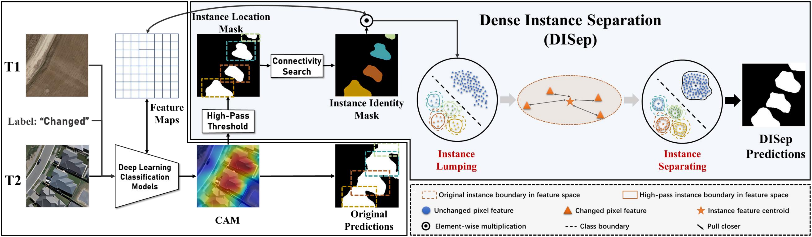
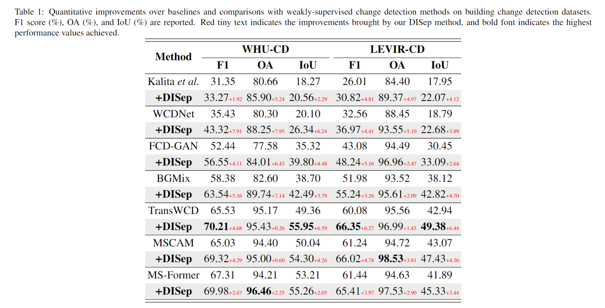
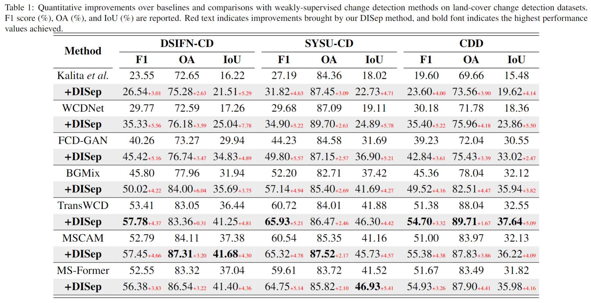

# Plug-and-Play DISep: Separating Dense Instances for Weakly-Supervised Change Detection
## :notebook_with_decorative_cover: Code for Paper: Plug-and-Play DISep: Separating Dense Instances for Scene-to-Pixel Weakly-Supervised Change Detection in High-Resolution Remote Sensing Images [[arXiv]](https://arxiv.org/abs/2501.04934)

<p align="center">
    
</p>

## Abastract <p align="justify">
#### a) DISep is designed to separate overlapping dense instances for weakly-supervised change detection. 
#### b) It ensures more accurate counting of change instances, when only knowing that a scene has changed. 
#### c) As a plug-and-play module, it can be integrated with any baseline pipelines, without adding any inference overhead.


## :speech_balloon: DISep Overview:
<p align="center">
    
</p>


##
## A. Preparations
### 1. Dataset Structure 

``` bash
WSCD dataset with image-level labels:
├─A
├─B
├─label
├─imagelevel_labels.npy
└─list
```

### 2.Create and activate conda environment

```bash
conda create --name xxx python=3.6
conda activate xxx
pip install -r requirments.txt
```

##
## B. Train and Test
The DISep module is located in the [`./DISep_module`](./DISep_module) directory. It can be seamlessly integrated into any training process without modifying the inference process, as shown in the code example we provide.

```bash
# train 
python train.py

```

###
```bash
# test
python test.py
```


##
## C. Performance
<p align="center">
    
</p>
<p align="center">
    
</p>

## Citation
If it's helpful to your research, please kindly cite. Here is an example BibTeX entry:

``` bibtex
@misc{zhao2025plugandplaydisepseparatingdense,
      title={Plug-and-Play DISep: Separating Dense Instances for Scene-to-Pixel Weakly-Supervised Change Detection in High-Resolution Remote Sensing Images}, 
      author={Zhenghui Zhao and Chen Wu and Lixiang Ru and Di Wang and Hongruixuan Chen and Cuiqun Chen},
      year={2025},
      eprint={2501.04934},
      archivePrefix={arXiv},
      primaryClass={cs.CV},
      url={https://arxiv.org/abs/2501.04934}, 
}
```


